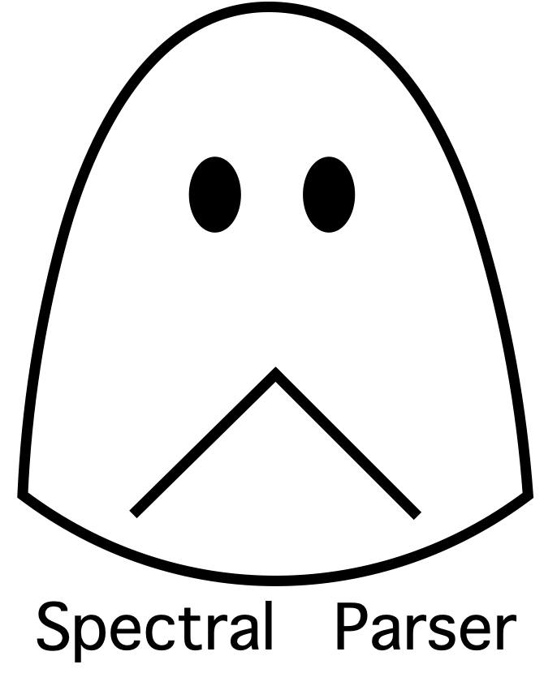

<p align="center">
  
</p>

A high-performance implementation of Spectral Learning of Latent-Variable PCFGs [(Cohen et al., 2013)](https://www.aclweb.org/anthology/N13-1015/). This work was done for my undergraduate dissertation at the University of Edinburgh, under the supervision of Dr. Shay Cohen.

The codebase is only tersely commented. If you want to know more about the algorithm, how it is implemented, and its performance, you should consult my dissertation `dissertation.pdf`. 

### Pre-requisites

Install the requirements:
```
pip3 install -r requirements.txt
```

### Global Configuration File

`spectral_parser/config.py` contains all the configurable variables, including file paths, output directory, hyperparameters etc. You need to configure this file before training/testing.

### Training and Testing

Please run the commands from the `spectral_parser/` directory.

To train:
```
python3 train.py
```
The parameters will be saved to the output directory.

To parse a test file:
```
python3 test.py
```
The candidate parse file will be saved to the output direcoty and be called `parse.txt`.

### Data

The sanitized PTB WSJ datasets (taken from [Berkeley Neural Parser
](https://github.com/nikitakit/self-attentive-parser/tree/master/data)) are saved at `spectral_parser/data/`.

### To Cite this Work

```
@Misc{,
    author = {Haoran Peng},
    title = {Spectral Learning of Latent-Variable PCFGs: High-Performance Implementation},
    year = {2021},
    url = "https://github.com/GavinPHR/Spectral-Parser"
}
```
